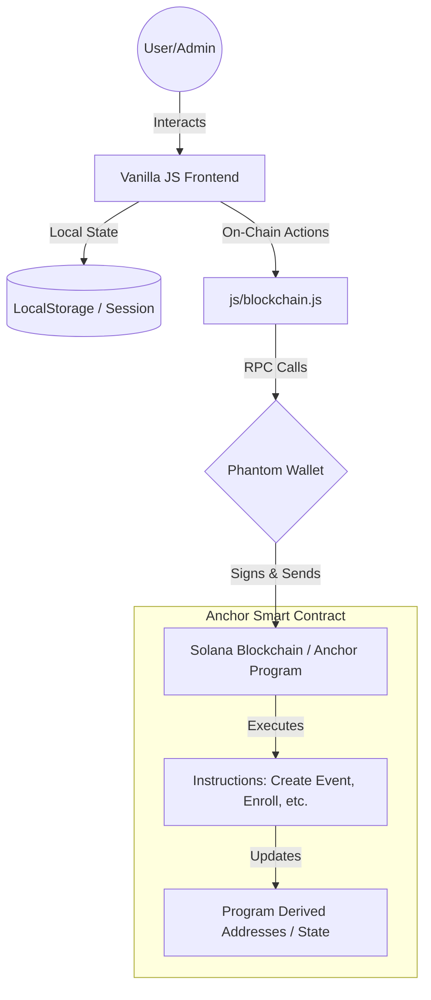
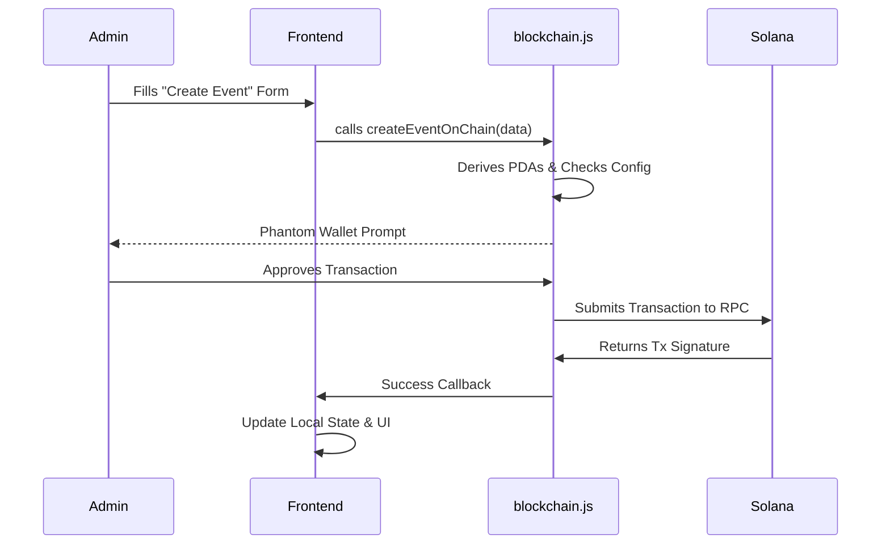

# ChainCampus | Decentralised Academic Identity System

ChainCampus is a production-grade academic management platform built on the Solana blockchain. It provides a secure, verifiable, and user-friendly ecosystem for student identities, course enrollments, event participation, and attendance tracking.

---

## 🏗️ System Architecture (Architect Perspective)

The system follows a **Decoupled Hybrid Architecture**, combining high-performance frontend state management with on-chain verification.

### High-Level Architecture

### Architectural Key Patterns
- **Abstraction Layer**: `js/blockchain.js` acts as a mediator, allowing the UI to remain agnostic of the underlying Web3 complexity. It supports an **Auto-Fallback mode**, ensuring the app remains functional (mock mode) even if the local validator is offline.
- **PDA Management**: Uses Program Derived Addresses (PDAs) seeded with unique identifiers (e.g., `student_id`, `event_id`) to ensure deterministic and secure account lookups on Solana.
- **Role-Based Access Control (RBAC)**: Distinct pathways for Students and Administrators, enforced at both the UI (route guards) and Contract level (authority checks).

---

## 💻 Technical Implementation (Developer Perspective)

The codebase is designed for **maintainability** and **clarity**, using modern ES modules and a modular Rust structure.

### Project Structure
- **/js**: Modularized logic. `main.js` manages global state; `admin.js` handles management; `blockchain.js` handles Solana integration.
- **/css**: A centralized CSS variable-driven design system (`styles.css`) focusing on a "Light SaaS" aesthetic.
- **/chain_campus**: Anchor-based smart contracts.
    - `instructions/`: Each transaction type is isolated in its own file (e.g., `create_course.rs`).
    - `state/`: Clean definitions of on-chain account structures.

### Development Workflow

---

## 🎯 Product Strategy (Product Manager Perspective)

### Core Features & Value Props
1. **Verifiable Identity**: Digital Student ID cards linked to Solana wallet addresses.
2. **Permissionless Participation**: Students register for events and courses with cryptographic proof.
3. **Admin Governance**: University staff can dynamically manage the academic catalog and verify records.
4. **Frictionless Onboarding**: A "Skip Wallet" flow allows traditional users to explore the platform before committing to Web3 actions.

### User Flow Analysis
- **Onboarding**: Simple email registration -> Optional Phantom link -> Personalized Dashboard.
- **Academics**: Browse Courses -> Enroll (On-Chain) -> Track Attendance.
- **Engagement**: View Events -> Register (On-Chain) -> Badge earned.

---

## 🚀 Actionable Insights & Future Roadmap

### Questions for Further Refinement
- **Scalability**: For a live campus (10k+ users), how should we handle the storage costs of on-chain metadata? (Suggestion: Use Compressed NFTs or off-chain IPFS storage).
- **Data Persistence**: Should we migrate from `localStorage` to a proper backend (SQLite/PostgreSQL) while keeping the *verification* logic on-chain?
- **Identity Verification**: Should student registration require a pre-approved "Dean's Signature" before the account is initialized on-chain?

### Suggested Improvements
1. **NFT Certificates**: Auto-generate an NFT badge upon course completion or event attendance.
2. **Mobile Integration**: Optimize the Light Theme for the Solana Mobile Stack (Saga/Solana dApp Store).
3. **Zk-Proof Attendance**: Use Zero-Knowledge proofs for marking attendance to protect student location privacy while ensuring they were physically present.

---
*Created by Antigravity AI for ChainCampus v1.0*
