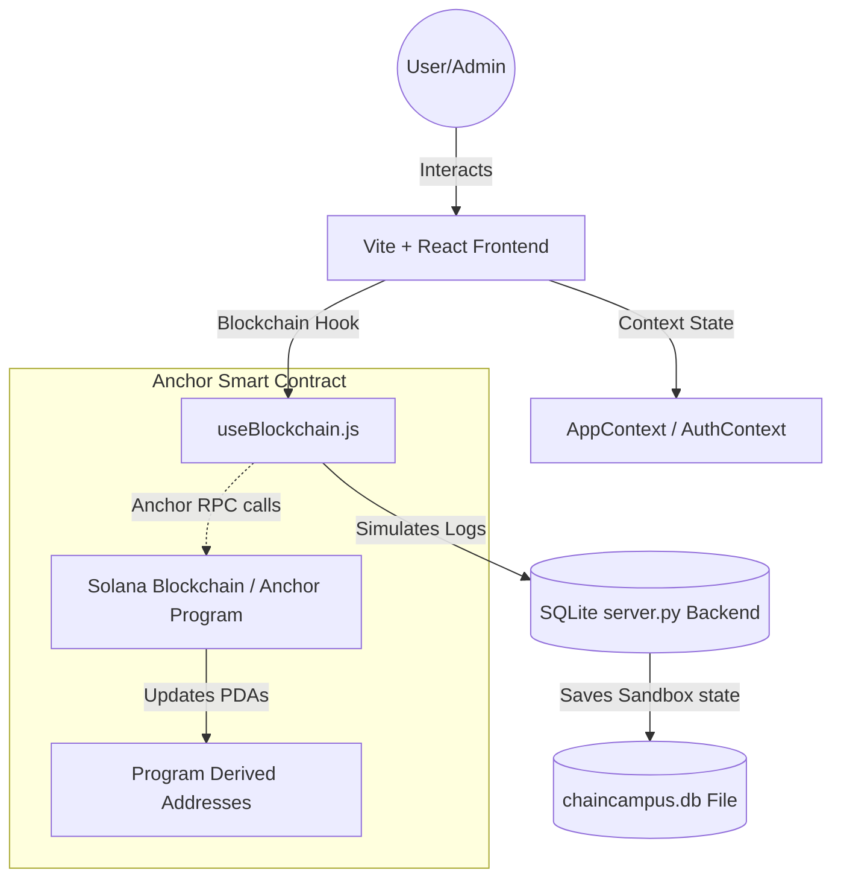
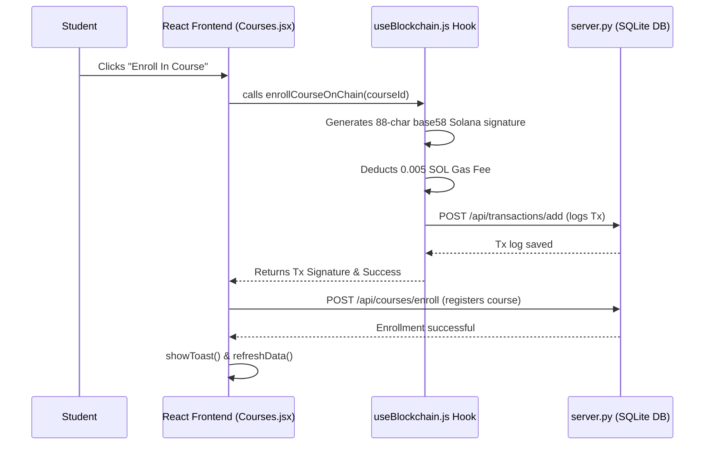

# ChainCampus | Decentralised Academic Identity System

ChainCampus is a production-grade academic management platform built on the Solana blockchain. It provides a secure, verifiable, and user-friendly ecosystem for student identities, course enrollments, event participation, and attendance tracking.

---

## 🏗️ System Architecture (Architect Perspective)

The system follows a **Decoupled Hybrid Architecture**, combining high-performance React context states with on-chain cryptographic signature verification and an SQLite sandbox ledger backend.

### High-Level Architecture

### Architectural Key Patterns
- **React Context Abstraction**: `AuthContext` and `AppContext` act as centralized state mediators, maintaining session records and syncing student details from the SQLite database.
- **Web3 Blockchain Abstraction Layer**: The `useBlockchain.js` hook encapsulates cryptographic logic, generating base58 simulated transaction signatures and subtracting gas fees (`0.005 SOL`), keeping the application logic clean and decoupled.
- **Relational Sandbox Persistence**: Standard SQLite tables (`users`, `courses`, `events`, `transactions`) enable teammates to run the presentation server locally and maintain data across page refreshes.
- **Role-Based Access Control (RBAC)**: Enforced via React private routing guards (`PrivateRoute`) and backend session checks on python request handlers.

---

## 💻 Technical Implementation (Developer Perspective)

The codebase is designed for **maximum maintainability** and **performance**, using modern ES modules, custom React hooks, and a modular Rust contract structure.

### Project Structure
- **/frontend/src/context**: Multi-state contexts (`AuthContext.jsx`, `AppContext.jsx`) managing login sessions and global listings.
- **/frontend/src/hooks**: Custom hooks (`useApi.js` for SQLite requests, `useBlockchain.js` for transaction signature simulations).
- **/frontend/src/components**: Beautiful, reusable components (like the interactive 3D `IdCard.jsx`, `Toast.jsx`, and persistent `Sidebar.jsx`).
- **/frontend/src/index.css**: Centered design system variables defining the premium cream/light-sage theme, organic ambient glowing meshes, button active scales, and fluid card transitions.
- **/chain_campus**: Anchor-based smart contracts.
    - `instructions/`: Isolated rust instruction sets (e.g., `create_course.rs`).
    - `state/`: On-chain PDA account states.

### Transaction Verification Workflow

---

## 🎯 Product Strategy (Product Manager Perspective)

### Core Features & Value Props
1. **Verifiable Credential ID**: 3D holographic digital ID cards representing secure student credentials.
2. **On-Chain Audit Ledger**: Every enrollment, registration, and attendance mark produces a cryptographic signature.
3. **Admin Governance**: College administration commands courses, schedules events, and triggers real-time scholarship payouts.
4. **Offline Presentation Mode**: Runs immediately out-of-the-box with no deployed RPC nodes required, ensuring smooth demo performance.

### Suggested Roadmap
1. **NFT Graduation Credentials**: Auto-minting an NFT credential badge upon final semester completion.
2. **Solana Mobile Stack (SMS)**: Custom mobile adaptions supporting wallet adapter taps on SMS devices.
3. **ZK-Proof Physical Attendance**: Leveraging Zero-Knowledge proofs for marking class attendance to protect student location privacy while verifying presence.

---
*Created by Antigravity AI for ChainCampus v1.1*
